# TCP - 三次握手
* 0. TCP Header简介
* 1. 三次握手过程
* 2. 三次握手状态
* 3. 三次握手丢包及重传
* 4. TCP-灵魂拷问
* 5. 发生在三次握手阶段的DDoS攻击
* 6. DDoS防护（未完成）
---
## 0. TCP Header
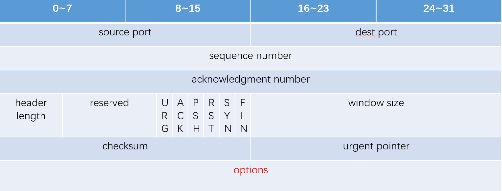

如上图所示，为标准的TCP头部字段.

| field | length (bit)| description | 
| --- | --- |--- | 
| source port | 16 | 源端口号：取值范围1~65535| 
| dest port | 16 | 目的端口号: 取值范围1~65535|
| sequence number | 32 | 序列号：用于标识字节流中的数据，在单个连接中，每个字节都有一个唯一的序列号，且必须是连续的（暂时不考虑序列号环绕的场景）| 
| acknowledgment number | 32 | 确认号: 用于标识对字节流的确认，每收到一个字节，确认号加1，确认号必须是连续的|
| header length | 4 | tcp头部长度，包含option字段的长度，最小值为5（代表头部长度为20字节，不包含任何option），最大值为15(代表最大TCP头部长度为15*4=60字节,包含若干option) | 
| reserved | 6 | 保留字段，用于扩展，目前已经用了2bit(ECN、CWR)|
| window size | 16 | 窗口大小：用于通知对端，我的buffer还可以接收多少数据，不要发送太多的数据（可以拓展出零窗口，窗口扩大选项）|
| checksum | 16 | 校验和（TODO: 校验和计算方式，raw socket） |
| urgent pointer | 16 | 紧急指针（没什么用） |
| option | 0～320 | TCP选项字段：0~40字节，受限于header length（最大值为15）。<br>随着网络的高速发展，TCP的问题越来越突出：想要扩展功能，需要不断的增加各种选项, 如TFO等; <br>由于TCP协议大多数都是集成在操作系统的内核中，想要新增一个option，需要操作系统、网络设备升级支持支持，推广难度巨大, 如TFO选项，已经诞生10多年了，依然没有推广起来 |


## 1. 三次握手过程
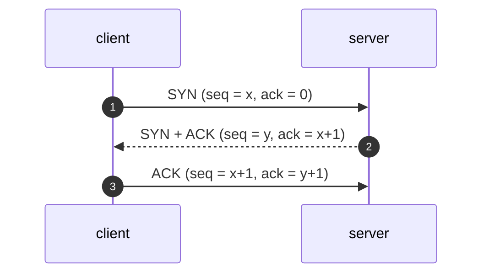
```mermaid
sequenceDiagram
participant client
participant server
autonumber
client ->>  server: SYN (seq = x, ack = 0)
server -->> client: SYN + ACK (seq = y, ack = x+1)
client ->>  server: ACK (seq = x+1, ack = y+1)
```

### 三次握手阶段主要完成两件事：
* 1. 协商序列号（用户保证后续数据传输的顺序）
* 2. 协商选项（如mss、timestamp等）

### 三次握手的序列号是如何生成的？
* RFC 793上有定义序列号的生成方式，但没有强制(感兴趣的可以去了解一下)。
* RFC定义的生成方式与时间戳相关，严格遵守RFC793实现的话，容易被攻击，具体可以搜索(Kevin Mitnick的TCP序列号预测).
* 现在大多数操作系统，已经将序列号的生成方式改成了全随机。

```
通常情况下，握手阶段是不传输任何数据的，除非两端开启了TFO（一个诞生了10多年都没推广起来的“很有用的协议”）.
```

---
## 2. 三次握手状态分析
### 2.1 TCP状态变迁图（TCP/IP详解上最经典的一张图）
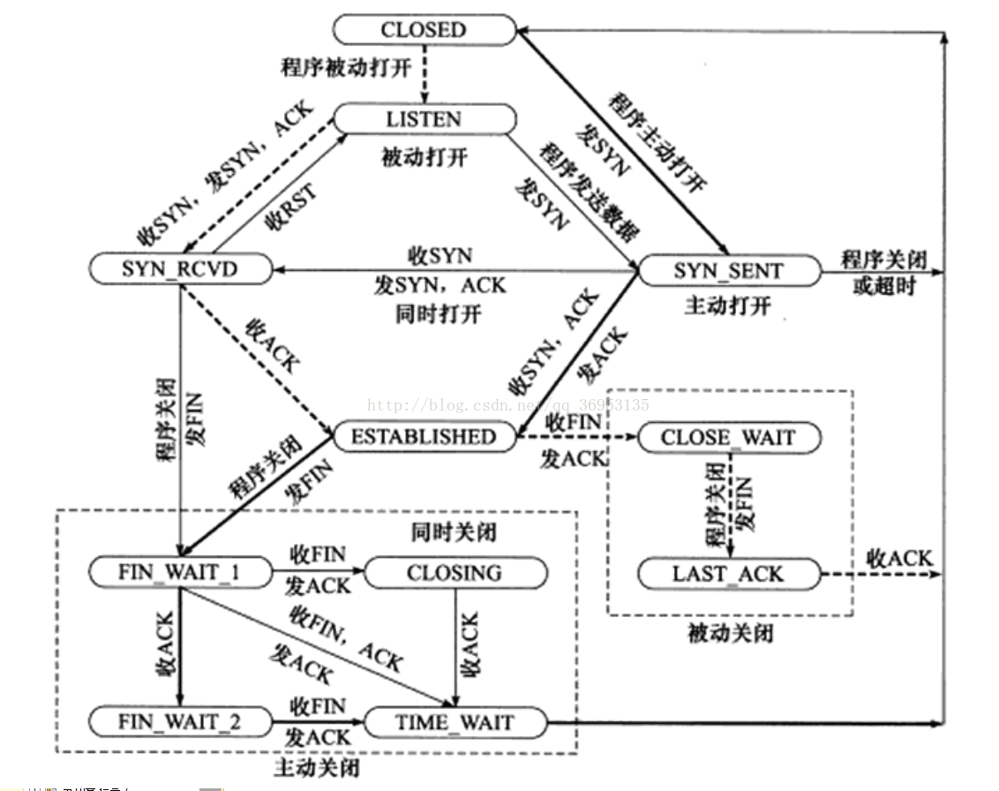

### 2.2 三次握手过程状态变迁
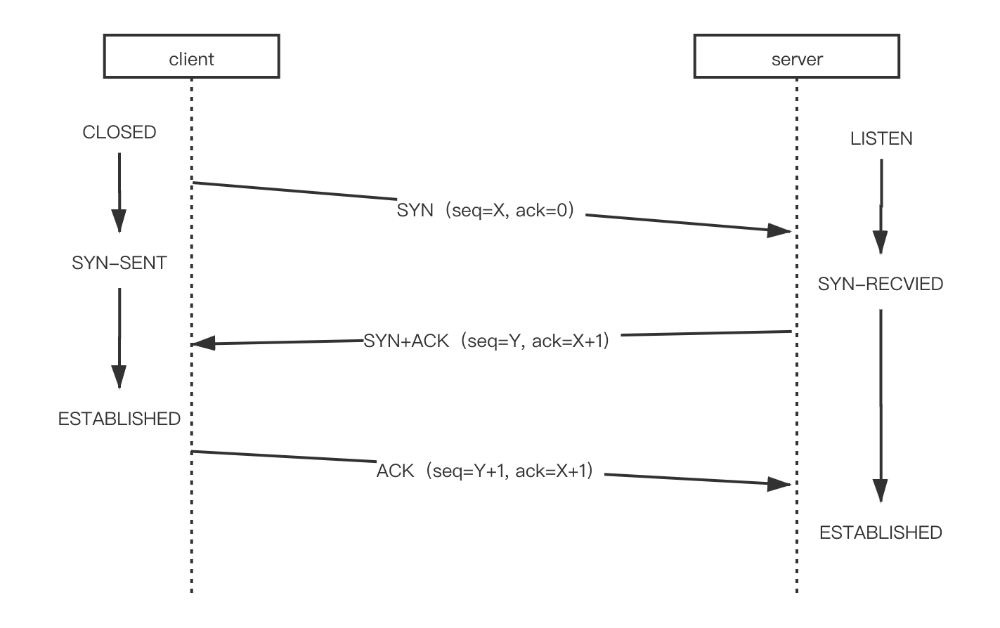

| phase | client| server | 
| --- | --- |--- | 
|  初始化阶段 | CLOSED | LISTEN | 
| client发送SYN之后（此时server还未收到） | <font color=#00b800> SYN-SENT</font> | LISTEN |
| server收到SYN之后 | <font color=#00b800> SYN-SENT</font> | <font color=#ff0000> SYN-RECEIVED </font> | 
| server响应SYN+ACK之后（此时client还未收到） | <font color=#00b800> SYN-SENT</font> | <font color=#ff0000> SYN-RECEIVED </font> |
| client收到SYN+ACK之后| <font color=#ff0000> ESTABLISHED </font> | <font color=#ff0000> SYN-RECEIVED </font>  |
| client响应ACK之后| <font color=#ff0000> ESTABLISHED </font> | <font color=#ff0000> SYN-RECEIVED </font>  |
| server收到ACK之后| <font color=#ff0000> ESTABLISHED </font> | <font color=#00b800> ESTABLISHED </font>  |
---

### 2.3 Linux 三次握手状态变化
```
在linux操作系统上，一般是看不到SYN-RECEIVED的：
1. linux server在收到第1个SYN包之后，并不会将状态改为SYN-RECEIVED。（与RFC规定有差别）
2. server在收到第3个ACK包之后，先将状态修改为SYN-RECEIVED，然后马上就修改为ESTABLISHED了（所以SYN-RECEIVED是一个转瞬即逝的状态，一般看不到）。
具体请参考内核实现
```

## 3. 三次握手丢包及重传分析
### 3.1 丢包简介

* 网络丢包是一种很常见的显现，丢包原因也有多种，例如: 
1. 路由器临时故障；
2. 网络拥塞;
3. 防火墙过滤检验等；

* 丢包可以发生在任何阶段，在本文中我们主要分析的是三次握手阶段的丢包。

* TCP做为一个可靠协议，当丢包发生时，无论是client还是server，都会有对应的检测及重传机制， 重传机制主要分两种类型：

|重传机制| 类型 | 简介 |
| --- | --- | --- |
|定时器 | 主动重传 | 自己维护一个定时器，超时之后自动触发
包触发 | 被动重传 | 收到对端的异常通知（对端重传了自己已经收到的包）之后，才知道自己出了问题

### 3.2 - SYN丢包及重传

#### 3.2.1 SYN丢包及重传示意图
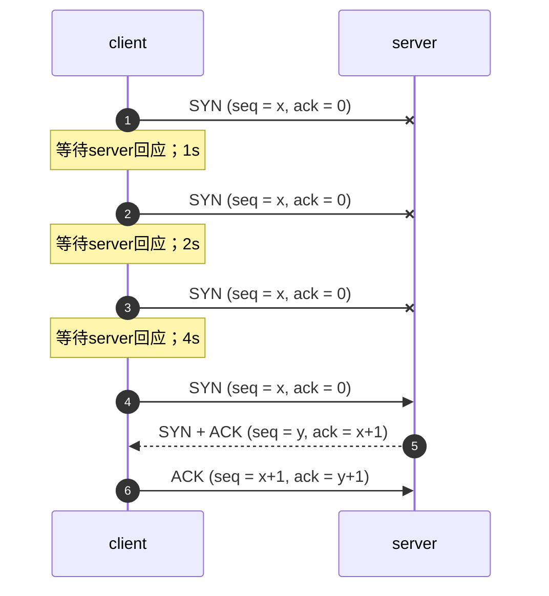
```mermaid
sequenceDiagram
participant client
participant server
autonumber

client-x server: SYN (seq = x, ack = 0)
note over client: 等待server回应；1s
client-x server: SYN (seq = x, ack = 0)
note over client: 等待server回应；2s
client-x server: SYN (seq = x, ack = 0)
note over client: 等待server回应；4s
client->> server: SYN (seq = x, ack = 0) 
server-->>client: SYN + ACK (seq = y, ack = x+1)
client->>server:  ACK (seq = x+1, ack = y+1)
```

* SYN丢包之后的重传是依赖于定时器触发的，TCP有四种定时器：
1. 重传定时器(retransmission timer)
2. 坚持定时器(persistent timer)
3. 保活定时器(keepalive timer)
4. 时间等待定时器(time_wait timer)

```
1. 在三次握手阶段，只会用到重传定时器(retransmission timer)，该定时器分两类：三次握手阶段的重传定时器、数据传输阶段的重传定时器。
2. 数据传输阶段的定时器有很复杂的公式，会涉及到拥塞控制算法，本文不讨论。
3. 以下提到的定时器，如未特殊说明，默认指的都是“三次握手阶段的重传定时器”。
```

* 定时器什么时候开始计时？
  在client发送SYN包之后，会开启定时器计时。

* 定时器什么时候触发SYN包重传？
  在超时之前，如果未收到server的响应，会触发SYN的重传，如上图中的2、3。

* 重传定时器的超时间隔是怎么定义的？
    1. 初始超时间隔在RFC中是有明确规定的：

    |RFC| 间隔 | 备注 |
    | --- | --- | --- |
    | RFC 1122| 3s | 应该是在当时的网络环境下，经过大量的数据统计之后得出的一个最佳值 | 
    | RFC 6298 2.1 |  1s | 大概在2009年以后，具体时间不记得了，RFC做了调整，改成了1s，因为3s时间太长了|
    
    2.  初始超时间隔在linux kernel中的定义:
    include/tcp/tcp.h - TCP_TIMEOUT_INIT

    3. “斗地主”机制: 
    每次较上一次重传间隔加倍，直到最大超时次数。

* 定时器什么时候结束？
   1. 收到server的响应(SYN+ACK/RST)
   2. 超过最大重传次数(后面有单独介绍)

### 3.3 - SYN+ACK的丢包及重传

#### 3.3.1 简介
SYN+ACK的丢包重传场景比较复杂，包含了“定时器重传”和“包触发重传”两种方式。

#### 3.3.2 定时器重传
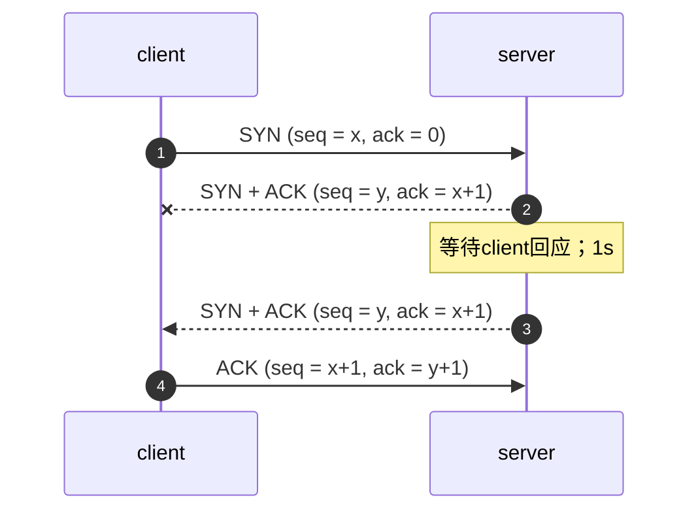
```mermaid
sequenceDiagram
participant client
participant server
autonumber

client ->> server: SYN (seq = x, ack = 0)
server --x client: SYN + ACK (seq = y, ack = x+1)
note over server: 等待client回应；1s   
server -->> client: SYN + ACK (seq = y, ack = x+1) 
client ->> server: ACK (seq = x+1, ack = y+1)
```
* 如上图所示：server端也会维护一个重传定时器，用于监测SYN+ACK的丢包，重传机制和**3.2**中描述的一致。
 

#### 3.3.3 包触发重传
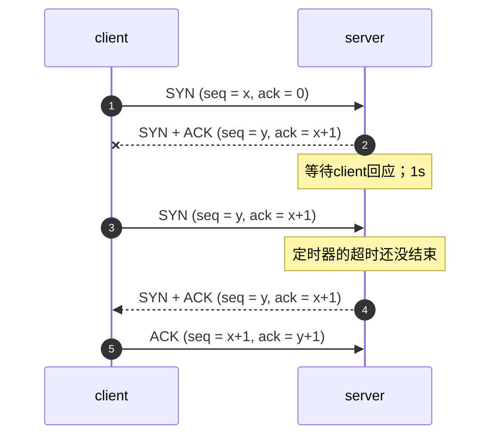
```mermaid
sequenceDiagram
participant client
participant server
autonumber
client ->> server: SYN (seq = x, ack = 0)
server --x client: SYN + ACK (seq = y, ack = x+1)
note over server: 等待client回应；1s   
client ->> server: SYN (seq = y, ack = x+1)
note over server: 定时器的超时还没结束
server -->> client: SYN + ACK (seq = y, ack = x+1) 
client ->> server: ACK (seq = x+1, ack = y+1)
```

如上图所示，server在等待超时期间收到了client重传的SYN包(对应的场景是：client没收到server的SYN+ACK，先重传了自己的SYN包)，
也会触发server端发送SYN+ACK。


### 3.4 ACK重传流程
#### 3.4.1 简介
ACK的丢包重传属于**包触发**式。

#### 3.4.2 重传示意图
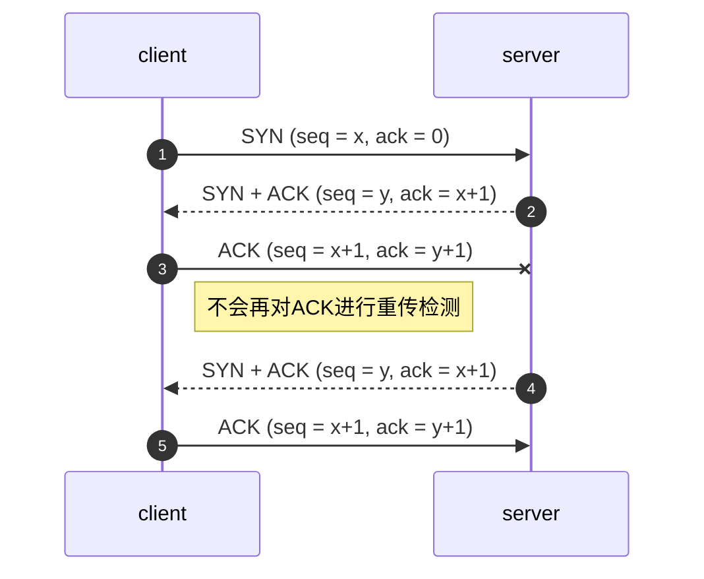
```mermaid
sequenceDiagram
participant client
participant server
autonumber

client ->> server: SYN (seq = x, ack = 0)
server -->> client: SYN + ACK (seq = y, ack = x+1)
client -x server: ACK (seq = x+1, ack = y+1)
note right of client: 不会再对ACK进行重传检测 
server -->> client: SYN + ACK (seq = y, ack = x+1)
client ->>  server: ACK (seq = x+1, ack = y+1)
```

* TCP协议规定：不要对ACK进行ACK确认，所以不需要为这次ACK设置定时器，client发出最后一个ACK包之后就不管了（RFC不让管）。
* 假如因为网络原因，server没收到第3个包（ACK），server会把责任揽到自己身上，认为是自己发的SYN+ACK对端没收到，会重传SYN+ACK，从而触发client对第3个包进行重传。
* client故意不发送最后一个ACK，server端会不断的重传SYN+ACK，直到超过最大次数（SYN-Flood，反射放大攻击）

### 3.5 三次握手阶段的重传次数限制
* RFC中没有规定重传次数，依赖操作系统的实现，如linux是定义在include/net/tcp.h中:
TCP_SYN_RETRIES    6   
TCP_SYNACK_RETRIES  5
* 一般操作系统会开放接口允许对重传次数进行动态调整，如linux操作系统：
/proc/sys/net/ipv4/tcp_syn_retries
/proc/sys/net/ipv4/tcp_synack_retries

### 3.6 其它
* 所有的TCP实现都是严格遵循RFC么？
NO， RFC只是定义了规范，但很多规范都是用了SHOULD，而不是用MUST，给了各个操作系统或用户态协议栈很多发挥空间：
有的操作系统出于某些目的（提高连接建立成功率等）会在RFC的基础上进行微调整，比方说苹果：前面几次重传间隔都是1s，没有加倍；


## 4 灵魂拷问 
### 4.1 为什么TCP握手是三次？
* 八股文里面的经典面试题，还有他的兄弟为什么挥手是四次？
 这个问题问得比较开放，很多人被突然问到的时候可能会比较懵逼。 友好一点儿面试官，可以再补上下一句：而不是1次、2次、4次？

* 考虑一个场景：

**两次握手**
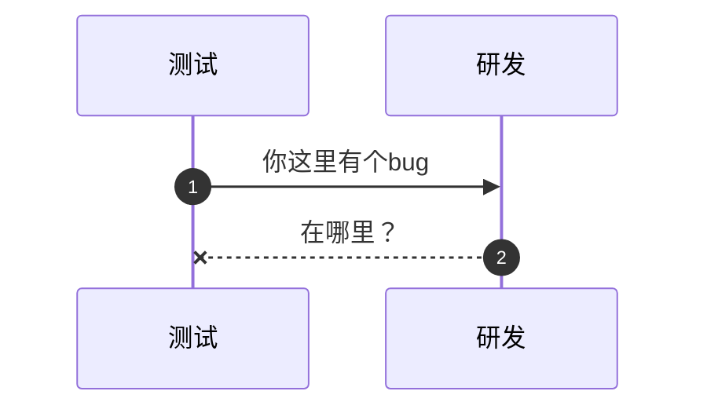
```mermaid
sequenceDiagram
participant 测试
participant 研发
autonumber
测试 ->> 研发: 你这里有个bug 
研发 --x 测试:  在哪里？
```
研发：老子想看看，你到底让不让。
显然两次是不能够保证连接一定建立起来了。


**四次握手**
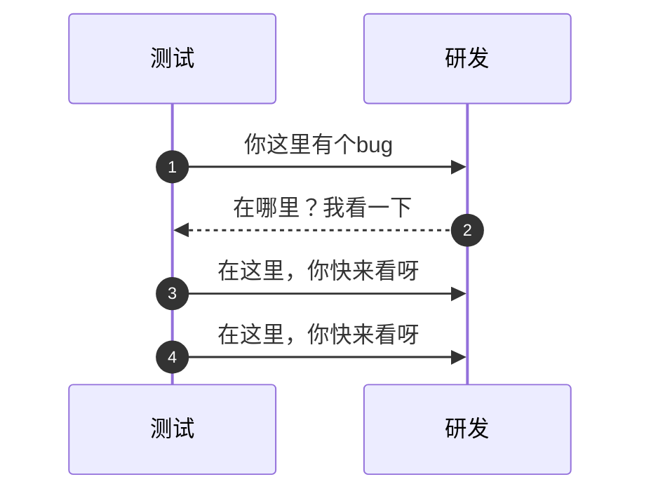
```mermaid
sequenceDiagram
participant 测试
participant 研发
autonumber
测试 ->> 研发: 你这里有个bug 
研发-->> 测试: 在哪里？我看一下
测试 ->> 研发: 在这里，你快来看呀
测试 ->> 研发: 在这里，你快来看呀
```
研发：老子知道了，别催了
可以看到，四次有点儿多余。

---

**三次握手**
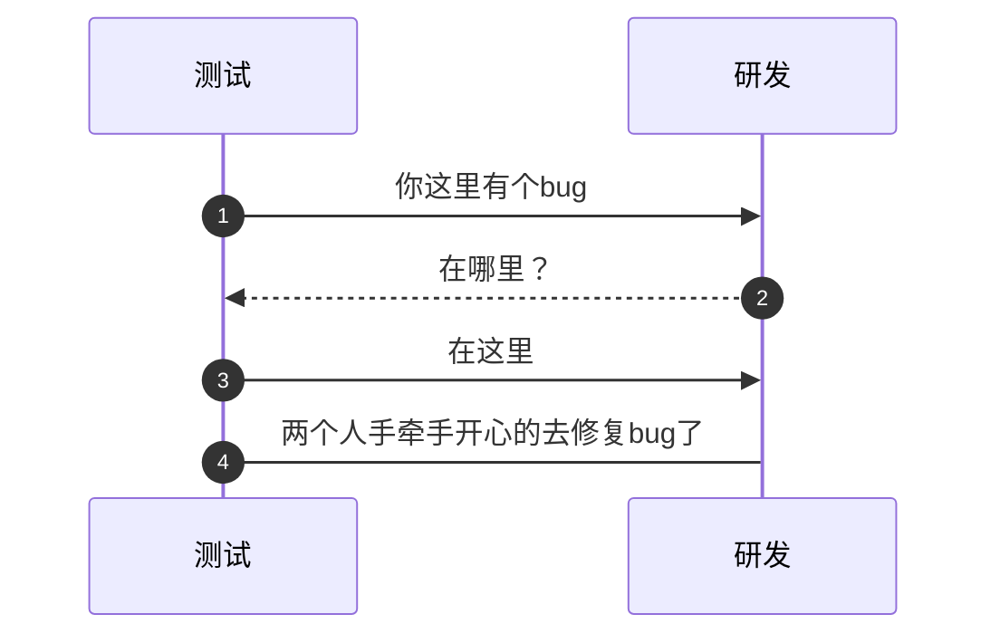
```mermaid
sequenceDiagram
participant 测试
participant 研发
autonumber
测试 ->>  研发: 你这里有个bug 
研发 -->> 测试: 在哪里？
测试 ->>  研发: 在这里
测试 ->   研发: 两个人手牵手开心的去修复bug了
```

### 4.2 TCP握手一定是三次么？
* 联想以下场景：
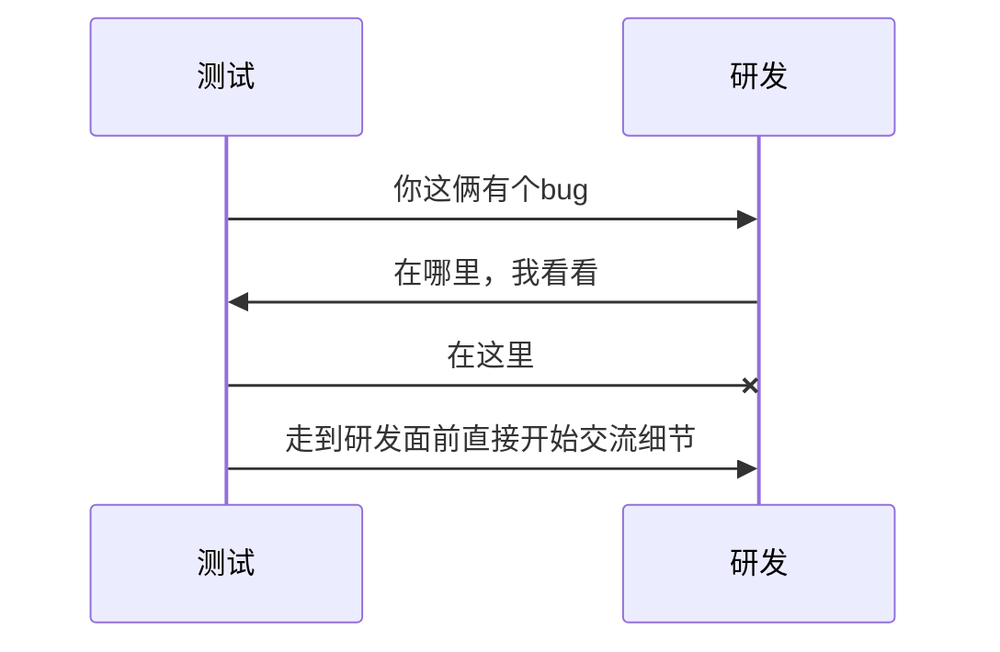
```mermaid
sequenceDiagram
participant 测试
participant 研发

测试 ->> 研发: 你这俩有个bug 
研发 ->> 测试: 在哪里，我看看
测试 -x  研发: 在这里
测试 ->> 研发: 走到研发面前直接开始交流细节
```
正常情况下，第3个包是没有必要发的，因为第4个包可以把必要的信息捎带过去。

* 联想完了，再回来看：
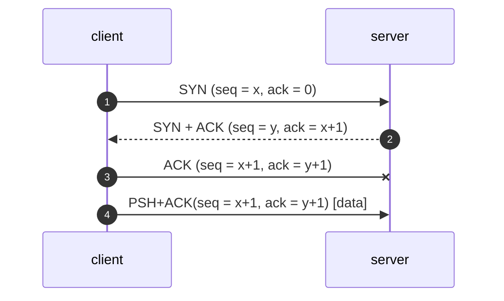
```mermaid
sequenceDiagram
participant client
participant server
autonumber
client ->> server: SYN (seq = x, ack = 0) 
server -->> client: SYN + ACK (seq = y, ack = x+1)
client -x server: ACK (seq = x+1, ack = y+1)
client ->> server: PSH+ACK(seq = x+1, ack = y+1) [data]
```
```
通常情况下，客户端在发送完第3个ACK包之后，就认为连接已经建立成功（自己进入了ESTABLISHED状态），就会开始发数据（不考虑攻击的场景）。
在这种情况下，即使第3个ACK包丢了，只要第4个包发能到对端，也可以完成三次握手。
```

* 很多追求极致性能的实现方案，会把这个包精简掉，三次握手的第3个包都不发，直接发送数据, 如下图:
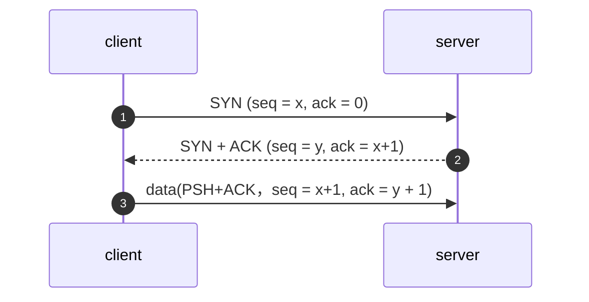
```mermaid
sequenceDiagram
participant client
participant server
autonumber
client ->> server: SYN (seq = x, ack = 0) 
server -->> client: SYN + ACK (seq = y, ack = x+1)
client ->> server: data(PSH+ACK，seq = x+1, ack = y + 1)
```


##5. 发生在三次握手阶段的DDoS攻击

##5.1 SYN-Flood攻击

### 5.1.1 SYN-Flood示意图
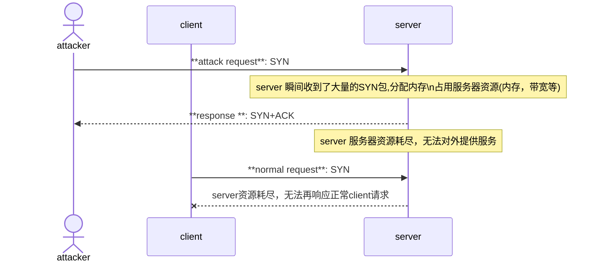
```mermaid
sequenceDiagram
actor attacker
participant client
participant server
attacker ->> server: **attack request**: SYN

note over server: server 瞬间收到了大量的SYN包,分配内存\n占用服务器资源(内存，带宽等)
server -->> attacker: **response **: SYN+ACK

note over server: server 服务器资源耗尽，无法对外提供服务
client ->> server: **normal request**: SYN
server --x client: server资源耗尽，无法再响应正常client请求
```

* DDoS攻击的主要目标是：资源（带宽、内存、CPU、磁盘），SYN-Flood主要攻击目标：带宽、内存（服务器的半连接队列）。

### 5.1.2 SYN-Flood为什么如此有效？
* 服务器需要维护连接以保证TCP的可靠性，维护连接就需要占用内存。
* 攻防资源不对称：服务器半连接队列受资源限制、带宽有限，攻击者有大量的肉鸡，带宽远超普通服务器。
* 服务器无法感知客户端的真实性，攻击者可以通过伪造源IP来隐藏自己。


## 5.2 空连接攻击
### 5.2.1 攻击示意图
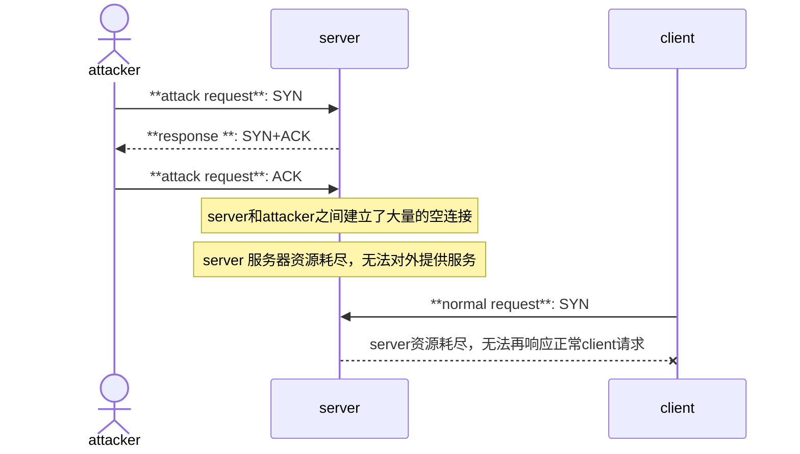
```mermaid
sequenceDiagram

actor attacker
participant server
participant client
attacker ->> server: **attack request**: SYN
server -->> attacker: **response **: SYN+ACK
attacker ->> server: **attack request**: ACK

note over server: server和attacker之间建立了大量的空连接
note over server: server 服务器资源耗尽，无法对外提供服务
client ->> server: **normal request**: SYN
server --x client: server资源耗尽，无法再响应正常client请求
```

* 空连接的攻击方式很简单：和服务器建立大量的连接，不发送任何数据。

### 5.2.2 空连接和SYN-Flood的区别
1. 空连击建立的是完整的三次握手，攻击者用的都是真实的源IP。
2. SYN-Flood容易检测，空连接不容易检测（如果服务器上有大量的SYN-RECEIVED状态的连接，就说明是SYN-Flood攻击）
3. 空连接可以突破一些基于连接的防火墙。

## 5.3 SYN+ACK反射攻击
### 5.3.1 攻击示意图
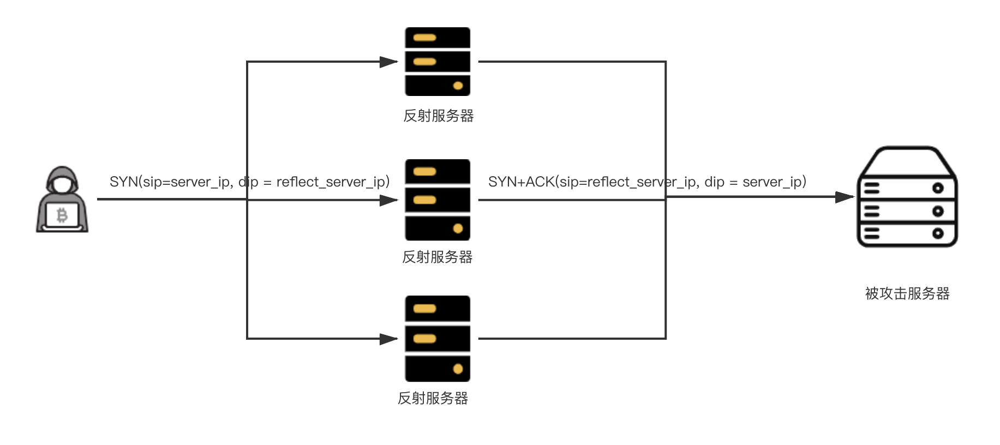
如上图所示：
1. attacker 伪造被攻击服务器的源IP，向反射服务器发送大量的SYN请求。
2. 反射服务器收到请求之后，解析出源IP，以为是被攻击服务器发送的请求，会响应SYN+ACK到被攻击服务器。
3. 被攻击服务器此时会收到大量的SYN+ACK包

### 5.3.2 SYN+ACK攻击的特点
1. 攻击者不需要暴露自己的IP，达到隐藏自己的目的。
2. 公网上有大量的反射服务器，无需自己准备肉鸡资源。
3. 由于SYN+ACK的重传机制，攻击者发送一个SYN包，会导致反射服务器发送多个SYN+ACK给被攻击服务器，达到放大攻击的效果。


##6. DDoS防护简介（未完成）

### 6.1 服务器防护方法: 开启syncookie

### syncookie如何开启？
```
sysctl -w net.ipv4.tcp_syncookies = 1
```

### syncookie原理：
核心思想：延迟分配内存（待确认是真正的连接的时候再分配内存）。

#### 未开启syncookie的三次握手
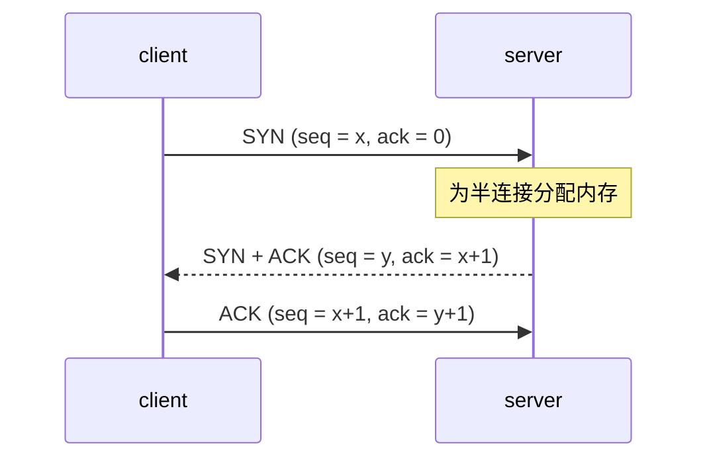
```mermaid
sequenceDiagram
participant client
participant server
client ->>server: SYN (seq = x, ack = 0)
note over server: 为半连接分配内存
server -->> client: SYN + ACK (seq = y, ack = x+1)
client ->> server: ACK (seq = x+1, ack = y+1)
```

#### 开启syncookie的三次握手
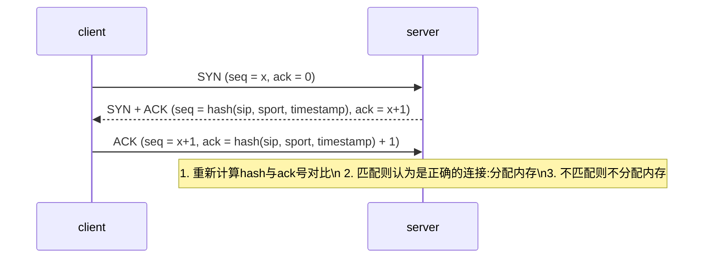
```mermaid
sequenceDiagram
participant client
participant server
client ->> server: SYN (seq = x, ack = 0)
server -->> client: SYN + ACK (seq = hash(sip, sport, timestamp), ack = x+1)
client ->> server: ACK (seq = x+1, ack = hash(sip, sport, timestamp) + 1)
note over server: 1. 重新计算hash与ack号对比\n 2. 匹配则认为是正确的连接:分配内存\n3. 不匹配则不分配内存
```

#### syncookie的问题？

**TODO**

### 6.2 其它防护方法
* 首包丢弃(TODO)
* saferst(TODO)
* 限速
----
