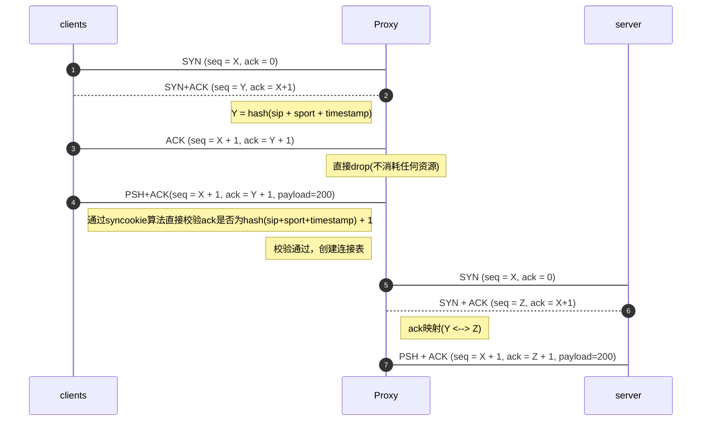
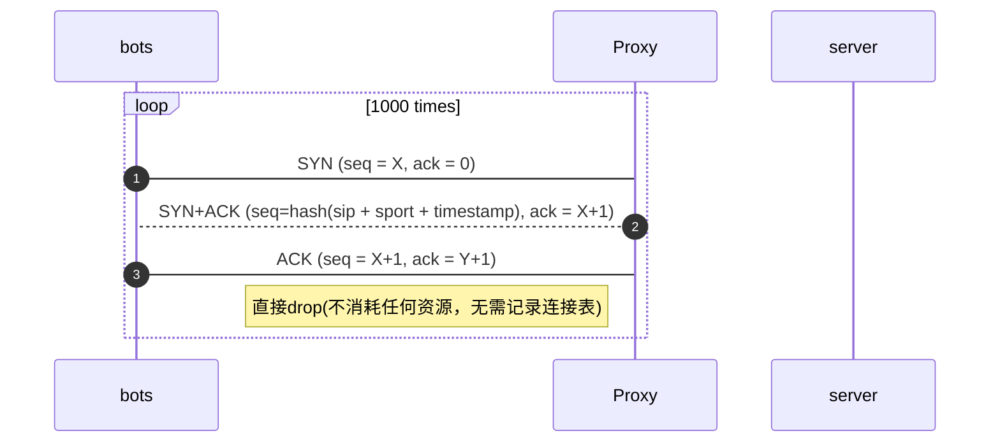

# 空连接防御方案

* proxy作为反向代理，正常客户端工作流程如下：


--- 

```
核心原理:延迟syncookie的校验过程
三次握手最后一个ACK(seq=X+1、ack=Y+1)
三次握手完的第一个请求(seq=X+1、ack=Y+1)
如果客户端是正常的，我们校验完第一个payload包里面的ack号后再创建连接。
如果客户端是异常的，我们就省了最后的连接表了。
```
