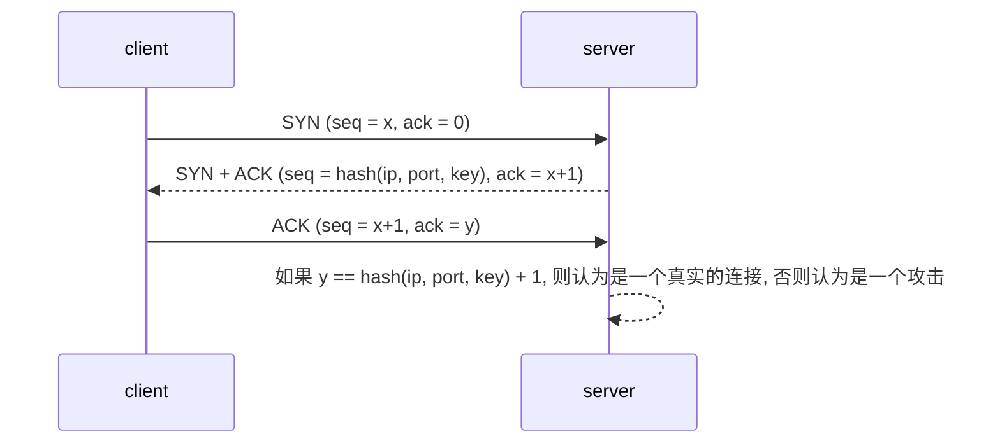
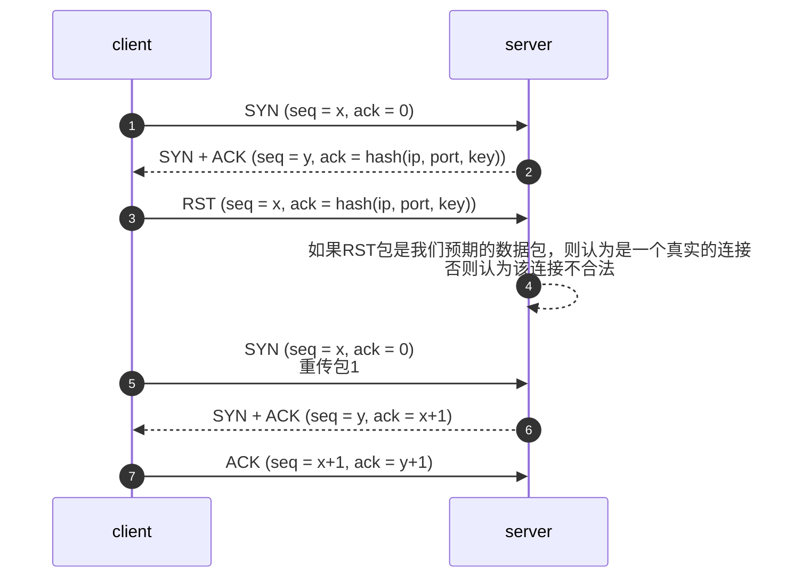

# SYN-Flood防护算法

---
**业界常用的SYN-Flood防护算法有两种:**
1. saferst算法
2. syncookie算法

## syncookie算法：
syncookie时RFC专门用来解决SYN-Flood攻击的，具体请查阅RFC。


## saferst算法：



**这个算法很骚，不知道作者是谁，也没留下相关技术原理的资料，个人本着刨根问底的精神去读了一下RFC 793，还真找到了相关的来源：**

### *来源1*
```
RFC793 Page 33 Figure 9

      TCP A                                                TCP B

  1.  CLOSED                                               LISTEN

  2.  SYN-SENT    --> <SEQ=100><CTL=SYN>               ...

  3.  (duplicate) ... <SEQ=90><CTL=SYN>               --> SYN-RECEIVED

  4.  SYN-SENT    <-- <SEQ=300><ACK=91><CTL=SYN,ACK>  <-- SYN-RECEIVED

  5.  SYN-SENT    --> <SEQ=91><CTL=RST>               --> LISTEN


  6.              ... <SEQ=100><CTL=SYN>               --> SYN-RECEIVED

  7.  SYN-SENT    <-- <SEQ=400><ACK=101><CTL=SYN,ACK>  <-- SYN-RECEIVED

  8.  ESTABLISHED --> <SEQ=101><ACK=401><CTL=ACK>      --> ESTABLISHED

                    Recovery from Old Duplicate SYN

                               Figure 9.


      As a simple example of recovery from old duplicates, consider
  figure 9.  At line 3, an old duplicate SYN arrives at TCP B.  TCP B
  cannot tell that this is an old duplicate, so it responds normally
  (line 4).  TCP A detects that the ACK field is incorrect and returns a
  RST (reset) with its SEQ field selected to make the segment
  believable.  TCP B, on receiving the RST, returns to the LISTEN state.
  When the original SYN (pun intended) finally arrives at line 6, the
  synchronization proceeds normally.  If the SYN at line 6 had arrived
  before the RST, a more complex exchange might have occurred with RST's
  sent in both directions.

```

服务器(TCP B)收到包1，假如回复一个错误的SYN+ACK包（包4），客户端会回复一个RST包（包5），服务器收到这个包就会加信任。

客户端如果没收到正确的响应(SYN+ACK)，就会重传SYN包(类似包6)，之后就进入正常的三次握手流程了（6 7 8）


### *来源2*

```
RFC793 Page 34 Figure 10
      TCP A                                           TCP B

  1.  (CRASH)                               (send 300,receive 100)

  2.  CLOSED                                           ESTABLISHED

  3.  SYN-SENT --> <SEQ=400><CTL=SYN>              --> (??)

  4.  (!!)     <-- <SEQ=300><ACK=100><CTL=ACK>     <-- ESTABLISHED

  5.  SYN-SENT --> <SEQ=100><CTL=RST>              --> (Abort!!)

  6.  SYN-SENT                                         CLOSED

  7.  SYN-SENT --> <SEQ=400><CTL=SYN>              -->

                     Half-Open Connection Discovery

                               Figure 10.

  When the SYN arrives at line 3, TCP B, being in a synchronized state,
  and the incoming segment outside the window, responds with an
  acknowledgment indicating what sequence it next expects to hear (ACK
  100).  TCP A sees that this segment does not acknowledge anything it
  sent and, being unsynchronized, sends a reset (RST) because it has
  detected a half-open connection.  TCP B aborts at line 5.  TCP A will
  continue to try to establish the connection; the problem is now
  reduced to the basic 3-way handshake of figure 7.

```

### *来源3*
```
RFC 793 Page 66

 If the state is SYN-SENT then

      first check the ACK bit

        If the ACK bit is set

          If SEG.ACK =< ISS, or SEG.ACK > SND.NXT, send a reset (unless
          the RST bit is set, if so drop the segment and return)

            <SEQ=SEG.ACK><CTL=RST>

          and discard the segment.  Return.

RFC793 Page 70

      ESTABLISHED
      FIN-WAIT-1
      FIN-WAIT-2
      CLOSE-WAIT

        If the RST bit is set then, any outstanding RECEIVEs and SEND
        should receive "reset" responses.  All segment queues should be
        flushed.  Users should also receive an unsolicited general
        "connection reset" signal.  Enter the CLOSED state, delete the
        TCB, and return.

```

1. 来源1和来源2是解释为什么客户端收到错误的SYN+ACK包后会响应RST包。（就是TCP协议规定要这么干）
2. 来源3是解释为什么客户端会重传之前的SYN包（因为只要求discard the segment，并没有要求delte the TCB）

**开启saferst算法之后，client会重传之前的SYN包，为什么？**
之所以client会重传SYN，是因为上面的RFC并没有要求删除对应的TCB、重传队列，所以重传定时器会在超时（3s或1s）之后执行重传操作。
首次重传间隔：3s（旧的RFC标准） 1s（新的RFC标准）

**开启该算法的影响**
1. 某些防火墙比较傻瓜，会丢弃不合法的syn+ack包，导致该算法不能生效。
2. 连接会卡顿一下（1s或3s的超时重传）
