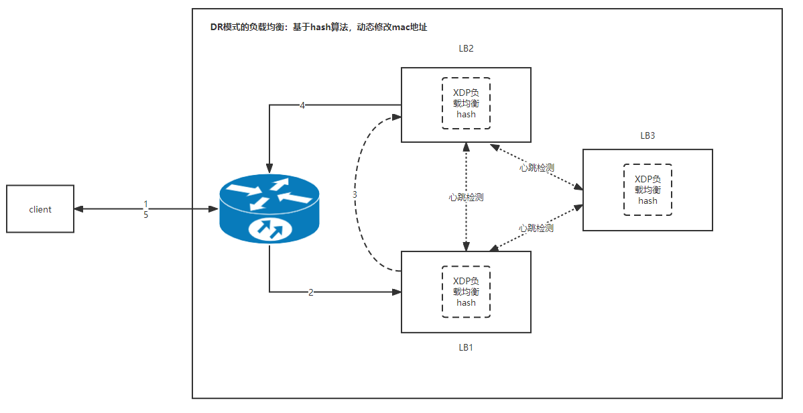

# XDP负载均衡方案

基于XDP可以实现LVS的DR、TUN两种负载均衡模式。

## DR模式

### 示意图

### 负载均衡算法
1. 可以在lb_kern.o中实现多种算法（基于IP、基于IP+Port等）
2. 可以给每种负载均衡算法设置独立的负载均衡因子（保存在map中，可以动态更新）
3. 可以基于不同的目标使用不同的负载均衡算法、不同的负载均衡因子

### 异常处理
1. 当某个lb节点发生故障的时候，通过外部的检测引擎，动态的更新LB策略（剔除节点、rehash等）
2. 新增或删除节点，会导致负载均衡因子发生变化，从而导致连接中断（如何保证影响范围最小？一致性hash）
